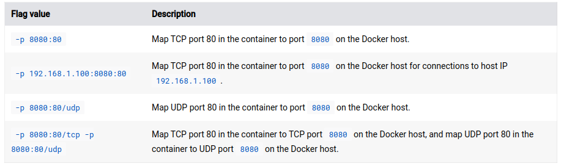
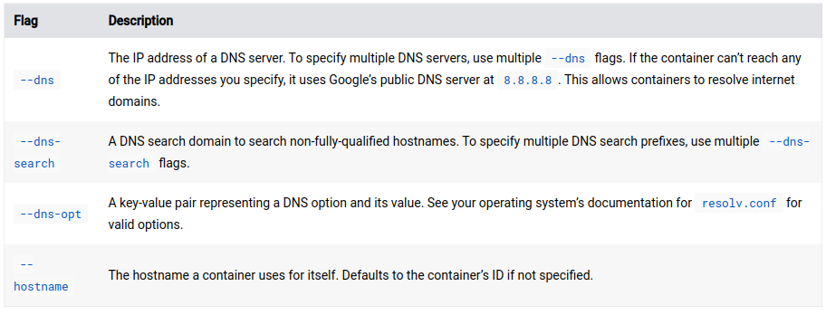

# Overview
* 容器本身并不知道它是哪种网络模式，容器本身只知道自己的network interface和ip，gateway，路由表之类的。none模式除外（只有一个本地的loopback）接口。

## Published ports
* 默认没有任何端口被暴露。
* 使用`--publish` or `-p` 可以暴露端口。
* 使用后会在host新建一条firewall rule，进行映射。
举例： 


注意：
* 暴露端口意味着不只是host可以看到，外部也可以看到。
* 如果是用localhost ip(127.0.0.1)暴露的端口，则只有host可以访问该端口。
* 但如果是同样的L2网段，比如连到同一个交换机，那么其他host也可以访问localhost ip暴露的端口。
e.g.:
```bash
docker run -p 127.0.0.1:8080:80 nginx
```

## IP & Hostname
* 默认情况下，Docker daemon动态分配子网和ip。
* 当使用`docker network connect` 连接网络时，可以使用`--ip` or `--ip6` 来指定ip。
* 容器默认hostname是容器ID，但可以用`--hostname`覆盖。当连接到现有network时候，可以用`docker network connect --alias`指定。

## DNS
* 默认从host的`/etc/resolv.conf`继承。
* 从custom network连接的容器，集成其DNS server。
* 可以显示指定，如下表。


### Nameservers with IPv6
参见Refs1

### Custom hosts
参见refs1

# Network drivers
## Overview
Docker的网络使用driver来提供功能。
* bridge: 默认。
* host: 直接使用host网络，没有网络隔离。
* overlay: 连接多个Docker daemon，使得其中的容器可以通信，去除了OS层面的路由需要。
* ipvlan: 给用户IPv4和IPv6上的完全控制。VLAN可以实现L2 VLAN tagging和IPvlan L3 routing。
* macvlan: 可以给容器指派MAC地址，使其看起来像实际设备。Docker Daemon路由数据到MAC地址。面对需要和物理网络同信时，macvlan可能是最好的解决办法，不需要通过Docker host网络栈来路由。
* none: 完全同host隔离，不能用在Swarm服务。
* Network plugins: 其他第三方的东西。

### Network driver summary

- The default bridge network is good for running containers that don’t require special networking capabilities.
- User-defined bridge networks enable containers on the same Docker host to communicate with each other. A user-defined network typically defines an isolated network for multiple containers belonging to a common project or component.
- Host network shares the host’s network with the container. When you use this driver, the container’s network isn’t isolated from the host.
- Overlay networks are best when you need containers running on different Docker hosts to communicate, or when multiple applications work together using Swarm services.
- Macvlan networks are best when you are migrating from a VM setup or need your containers to look like physical hosts on your network, each with a unique MAC address.
- IPvlan is similar to Macvlan, but doesn’t assign unique MAC addresses to containers. Consider using IPvlan when there’s a restriction on the number of MAC addresses that can be assigned to a network interface or port.
- Third-party network plugins allow you to integrate Docker with specialized network stacks.

## Bridge
* Docker bridge network使用软实现，自动在host建立rules，不同的bridge网络不能互相访问。
* Bridge network适用于同一个**Docker daemon**, 不同的docker daemon之间的通信参见overlay。
* 虽然有默认的bridge网络，但**推荐使用user-defined bridge网络**。
* 默认bridge不推荐在生产模式使用！！！

### 默认bridge和user-defined bridge的区别
#### 用户定义的bridge提供自动DNS解析
默认bridge网络只提供ip寻址。
#### 用户bridge提供更好隔离性
因为其他采用默认网络的container都连在了默认bridge上。

#### 每个用户bridge是可配置的
默认bridge也是可配置的，但是所有连上的container会采用相同配置，比如MTU和iptables规则。而且修改默认bridge需要重启docker。
用户bridge使用`docker network create`创建和配置，不同的规则可以创建不同的bridge。

#### 默认bridge共享环境变量
最初，在两个容器间共享变量的唯一办法是使用`--link`标志，用户bridge不能共享。但现在有更好的办法：
* 使用docker volume共享。
* docker-compose可以设置共享变量。
* 使用Swarm服务，利用secrets和configs。

### 端口
同一个用户bridge的容器间暴露所有端口，不同网络的需要用`-p`暴露端口。

### 操作
参见 https://docs.docker.com/network/drivers/bridge/

### 教程和实验
https://docs.docker.com/network/network-tutorial-standalone/
1. 默认bridge上果然不能ping container_name, 只能ping ip
2. 实验2使用用户bridge就可以ping container_name

## Overlay
Swarm还不太明白，先不看了。


## Host


# Refs
1. https://docs.docker.com/network/
2. https://docs.docker.com/engine/reference/run/#network-settings