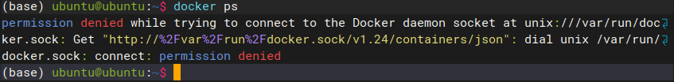

# Background - why sudo is needed for docker-cli
When we use docker commands, we always use sudo as prefix, otherwise it wil show like below:

which shows lacking of permission.
The reason is:
> The Docker daemon binds to a Unix socket, not a TCP port. By default it’s the `root` user that owns the Unix socket, and other users can only access it using `sudo`. The Docker daemon always runs as the `root` user.

# Manage docker as a non-root user
## Less sudos in commands, but still root privileges
Can we bypass the sudo prefix? Yes we can. 

> If you don’t want to preface the `docker` command with `sudo`, create a Unix group called `docker` and add users to it. When the Docker daemon starts, it creates a Unix socket accessible by members of the `docker` group. On some Linux distributions, the system automatically creates this group when installing Docker Engine using a package manager. In that case, there is no need for you to manually create the group.

But please be noted:
> The `docker` group grants root-level privileges to the user. For details on how this impacts security in your system, see [Docker Daemon Attack Surface](https://docs.docker.com/engine/security/#docker-daemon-attack-surface).

## Operations
Please refer to Refs 1.

# Rootless mode
In docker group, we're still using root-level privileges. Can we run the daemon and contianers as non-root? Yes, rootless mode.

## Why we need rootless mode?
> Rootless mode allows running the Docker daemon and containers as a non-root user to mitigate potential vulnerabilities in the daemon and the container runtime.
	Rootless mode does not require root privileges even during the installation of the Docker daemon, as long as the [prerequisites](https://docs.docker.com/engine/security/rootless/#prerequisites) are met.

In a nutshell, the container cannot use root priviledge in host, so this can **mitigate the most vulnerabilities to the host**.

# Refs
1. https://docs.docker.com/engine/install/linux-postinstall/