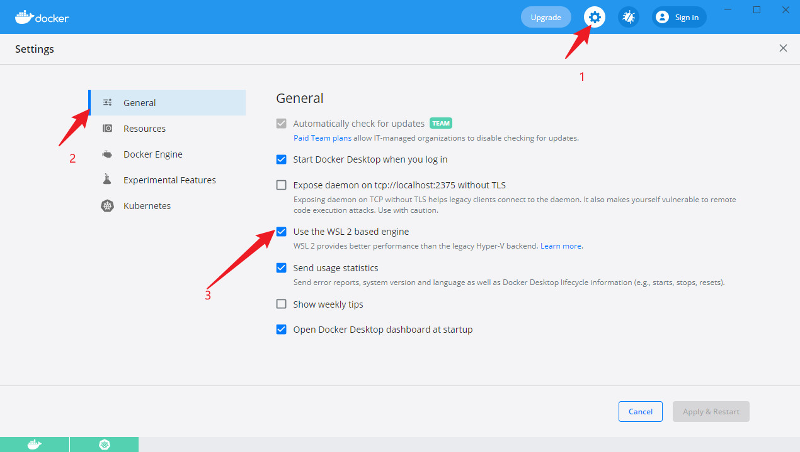
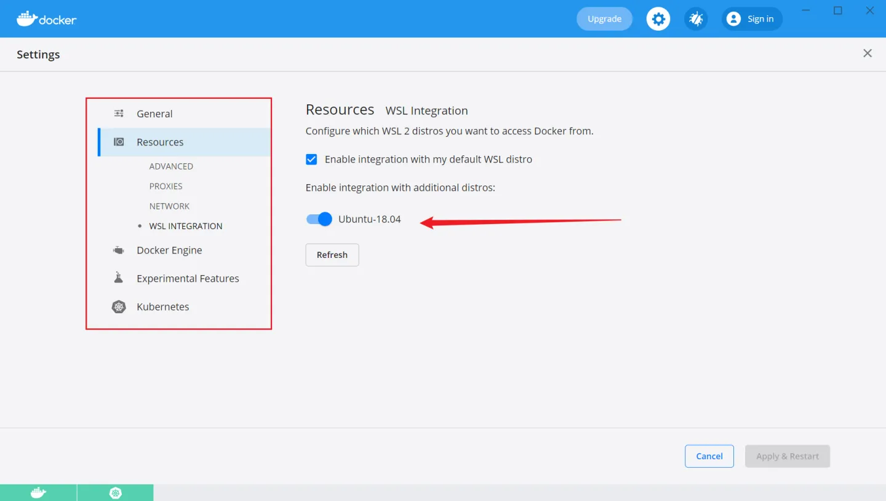
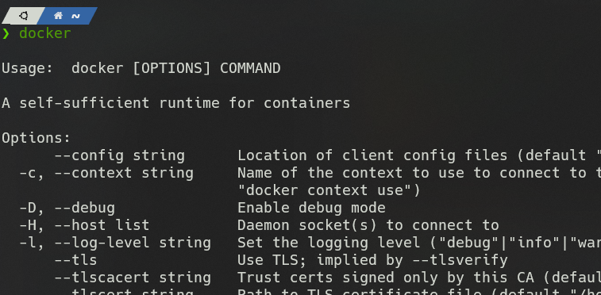
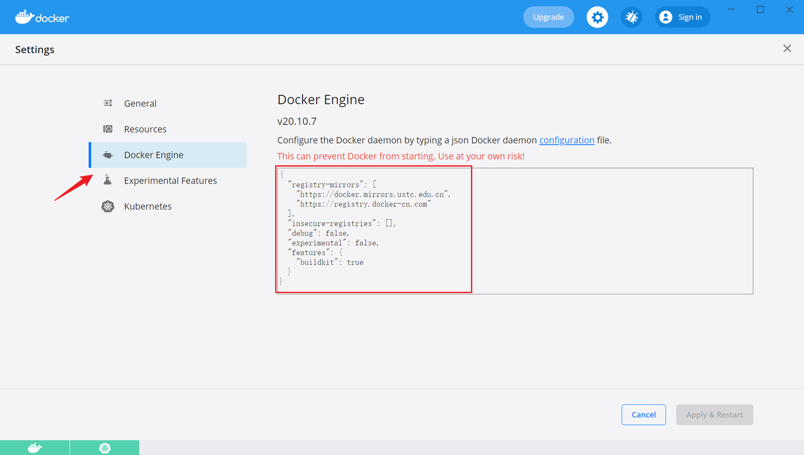
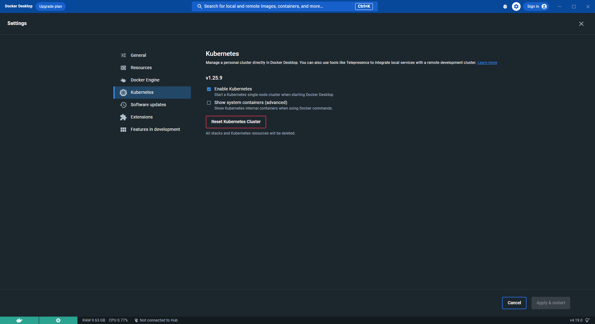

# 1. 安装WLS2和Ubuntu
[[Windows10工作环境搭建]]
[[WSL2]]
# 2. Docker desktop for WSL2
从docker官网下载并安装完成后，打开docker desktop，选择setting->General，确保Use the WSL 2 based engine选项被勾选，然后选择右下角Apply&Restart。

重启docker desktop后，再次打开设置，确保setting->Resources->WSL INTEGRATION选项页中你的WSL发行版被勾选。

完成以上步骤之后，打开你的wsl, 输入docker

出现这一堆说明安装成功。（如果不成功就重启ubuntu，或者重启docker desktop）
# 3. k8s for docker desktop
安装了docker desktop后，可以通过setting->Kubernetes，勾选Enable Kubernetes来为你的wsl提供k8s服务，但由于网络问题，通常不可能成功。
## 先换源（我挂的代理）
打开setting->Docker Engine，将右侧配置文件改为：
```json
{
  "registry-mirrors": [
    "https://docker.mirrors.ustc.edu.cn",
    "https://registry.docker-cn.com"
  ],
  "insecure-registries": [],
  "debug": false,
  "experimental": false,
  "features": {
    "buildkit": true
  }
}
```

Apply&Restart，重启docker desktop。
换源之后其实也不成功，这时候docker desktop左下角的图标是红色的。但是没关系，继续往下走。
## 执行k8s-for-docker-desktop的脚本
找个path放下面的git clone。
```bash
git clone https://github.com/AliyunContainerService/k8s-for-docker-desktop.git
```
> 注意：这里需要保持k8s-for-docker-desktop和docker desktop里的k8s版本要一致。一般我们都是直接最新的，所以应该是一致的。不一致的话参照refs里第一个。

在当前目录下执行：
```shell
.\load_images.ps1
```

> 如果因为安全策略无法执行 PowerShell 脚本，请在 “以管理员身份运行” 的 PowerShell 中执行 Set-ExecutionPolicy RemoteSigned 命令
或者你也可以在WSL内部切换到这个目录执行load_images.sh

最后一步，setting->Kubernetes 确保Enable Kubernetes被勾选，然后Apply&Restart，这时候你的docker desktop左下角会出现k8s的图标，并逐渐从黄色变成绿色，代表你的k8s环境启动成功。
如果不成功的话，点击setting->Kubernetes->Reset Kubernetes Cluster, 至少我是这么搞了才成功的。


# 4. 安装helm
参照refs 2里面的“用二进制版本安装”，注意操作都是在WSL里。

# 5. Dashboard
## 安装
使用recommended.yaml进行安装，先wget下来。
```bash
wget https://raw.githubusercontent.com/kubernetes/dashboard/v2.0.3/aio/deploy/recommended.yaml
```
然后使用kubectl安装。
```bash
$ kubectl apply -f recommended.yaml 
namespace/kubernetes-dashboard created
serviceaccount/kubernetes-dashboard created
service/kubernetes-dashboard created
secret/kubernetes-dashboard-certs created
secret/kubernetes-dashboard-csrf created
secret/kubernetes-dashboard-key-holder created
configmap/kubernetes-dashboard-settings created
role.rbac.authorization.k8s.io/kubernetes-dashboard created
clusterrole.rbac.authorization.k8s.io/kubernetes-dashboard created
rolebinding.rbac.authorization.k8s.io/kubernetes-dashboard created
clusterrolebinding.rbac.authorization.k8s.io/kubernetes-dashboard created
deployment.apps/kubernetes-dashboard created
service/dashboard-metrics-scraper created
deployment.apps/dashboard-metrics-scraper created
```
## 启动
前台启动
```bash
$ kubectl proxy
```
后台启动
```bash
nohup kubectl proxy >/dev/null &
```
现在可以访问：http://localhost%3A8001/api/v1/namespaces/kubernetes-dashboard/services/https%3Akubernetes-dashboard%3A/proxy/

## 登录
再开一个wsl bash，登录需要获取token
```bash
kubectl -n kube-system describe secret default| awk '$1=="token:"{print $2}'
```
然后把token拷贝到网页里

也可以用helm装，参照refs4

# 6. Kubeapps
Refer to Refs.5, type the scripts in WSL bash.


# Refs
1. https://zhuanlan.zhihu.com/p/407560411
2. https://helm.sh/zh/docs/intro/install/
3. https://zhuanlan.zhihu.com/p/405080558
4. https://artifacthub.io/packages/helm/k8s-dashboard/kubernetes-dashboard
5. https://kubeapps.dev/