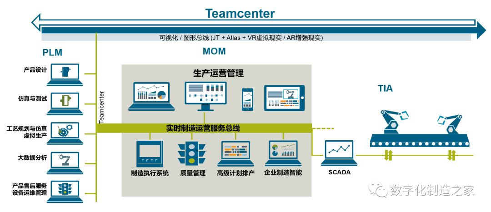
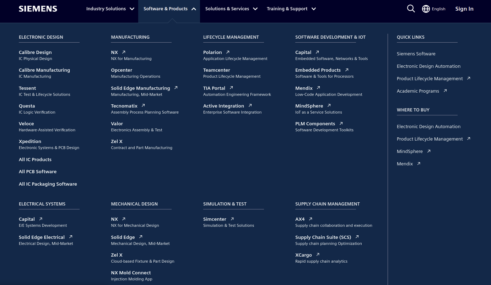

#智能制造 #智能制造之家 #西门子 #达索 #施耐德
# 来源
文章均来自智能制造之家公众号。
## 西家软件知多少
https://mp.weixin.qq.com/s?__biz=MzIwMjMxODAzNA==&mid=2247483949&idx=1&sn=d785d969673f6d390fc553250a6df9c7&chksm=96e1cb90a1964286f12398c98b0a9e3236b4e9a88bfc35d12dfeb23b34df2f906e22fcf9cc6b&scene=21#wechat_redirect
### 五层架构

### 西家软件
#### Teamcenter
https://plm.sw.siemens.com/en-US/teamcenter/

### PS：没那么复杂
在上面提到的网址上，https://plm.sw.siemens.com/en-US/teamcenter/，点击software&products，如图，可以看到主要的软件产品，然后点进去看就好了其实。

比如提到的Teamcenter，NX，Simcenter等。

### PS：Camstar去哪了？
毕竟曾经和Camstar打了那么久的交道，顺手一查，现在Camstar已经是Opcenter的一部分了。
https://www.plm.automation.siemens.com/global/en/our-story/glossary/camstar-systems/84297

## 西门子工业软件的历史介绍
https://mp.weixin.qq.com/s?__biz=MzIwMjMxODAzNA==&mid=2247495567&idx=1&sn=55873d7a5109e463b50ce2216859454a&chksm=96e22632a195af24d67753b656b138bd6c6e763ab8cb455058a3706acccd7ca8154bb37cc3e6&cur_album_id=1338543623163691011&scene=190#rd

### 名词
* PLM：产品生命周期管理
* MOM：生产运营管理。Manufacturing Operation Management
* ISA-95：
* 
### 节点和变更
1. 2019，Siemens PLM Software更名为Siemens Digital Industries Software
2. 2016，推出MindSpere
3. 2018.8，收购Mendix

### 产品线
看链接里吧，感觉变化很快，直接参照官网也行。
