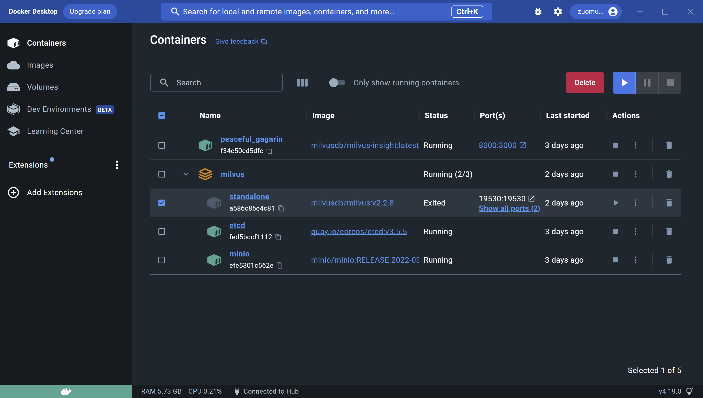

# 官网
[Vector database - Milvus](https://milvus.io/)

# 原理和架构
Milvus 基于 FAISS、Annoy、HNSW 等向量搜索库构建，核心是解决稠密向量相似度检索的问题。在向量检索库的基础上，Milvus 支持数据分区分片、数据持久化、增量数据摄取、标量向量混合查询、time travel 等功能，同时大幅优化了向量检索的性能，可满足任何向量检索场景的应用需求。通常，建议用户使用 Kubernetes 部署 Milvus，以获得最佳可用性和弹性。

Milvus 采用共享存储架构，​存储计算完全分离​，计算节点支持横向扩展。从架构上来看，Milvus 遵循数据流和控制流分离，整体分为了四个层次，分别为接入层（access layer）、协调服务（coordinator service）、执行节点（worker node）和存储层（storage）。各个层次相互独立，独立扩展和容灾。

## 基本概念
### 非结构化数据
非结构化数据指的是数据结构不规则，没有统一的预定义数据模型，不方便用数据库二维逻辑表来表现的数据。

非结构化数据包括图片、视频、音频、自然语言等，占所有数据总量的 80%。

非结构化数据的处理可以通过各种人工智能（AI）或机器学习（ML）模型转化为向量数据后进行处理。
### 特征向量
向量又称为 embedding vector，是指由 embedding 技术从离散变量（如图片、视频、音频、自然语言等各种非结构化数据）转变而来的连续向量。

在数学表示上，向量是一个由浮点数或者二值型数据组成的 n 维数组。

通过现代的向量转化技术，比如各种人工智能（AI）或者机器学习（ML）模型，可以将非结构化数据抽象为 n 维特征向量空间的向量。这样就可以采用最近邻算法（ANN）计算非结构化数据之间的相似度。

### 表结构
#### Collection
包含一组entity，类似于RDBMS中的表。
#### Entity
包含一组field。类似于RDBMS中的

# 安装
参照的 [强大的向量数据库：Milvus - 知乎 (zhihu.com)](https://zhuanlan.zhihu.com/p/405186060) 
用的docker-compose方式，官网上用的k8s，我不想装k8s。
也安装了文中的可视化管理的docker image。
为了装这个先装了Windows上的WSL2和Docker

# 参考
[强大的向量数据库：Milvus - 知乎 (zhihu.com)](https://zhuanlan.zhihu.com/p/405186060)
[Milvus 开源向量数据库 - 知乎 (zhihu.com)](https://www.zhihu.com/column/ai-search)

