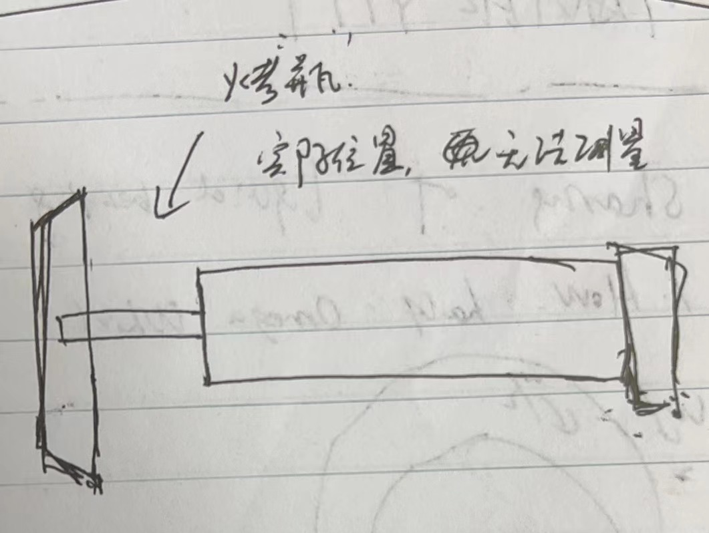

# Siemens X-ray Vacuum Technology, Wuxi
## Bearing@IoT solution sharing @ SXVT
1. 20220316
2. X-ray tube introducation
   1. 轴承
      1. 真空，固体润滑（银，铅），最高400摄氏度。
      2. 目前已经在测量噪声和震动（声压计）。
         1. 静音房：产线两个，实验室一个。水平+旋转测试。
         2. 对声音进行瞬时滑动声强测量。
   2. 轴承震动测试台（计划中）
   3. FEMA：
      1. Noise
      2. 卡轴
      3. 断轴
   4. 驱动：180Hz，转速>170Hz。CT：0.8s，悬臂支撑
3. Problem solving
   1. Noise failure rate = 4.36%, FPY = 5%, threshold: 60dB
   2. 跑和测试=>润。5个方向，1轮9个小时。
   3. 工艺：M1-球管封接，M2-电气测试，M3-装housing，注油。

## SXVT 第二次会议
1. 20220318
2. 联系人：
   1. 技术：Dong Xiao
   2. 商务：Le Qun Zhou
   3. 大佬：Cheng Ru Bai
3. Yu He 想法和反馈
   1. vendor质检服务，抽检
   2. M1：玻璃壳内。M2：玻璃球管。M3：注油测试。
   3. 返修的都测
   4. 排气
   
   5. RAY+SDR：小静音房。CT（XP）：大静音房。
4. 转速 （r/min）= 赫兹 （hz） × 60 （s）
5. 跑和：只镀银。镀铅的一般<55dB。 冷态-->58dB -->跑和 -->热态
6. 仪器：
   1. NTi XL2
   2. AWA6228 带串口
   3. SYANTEK977

   