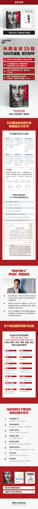
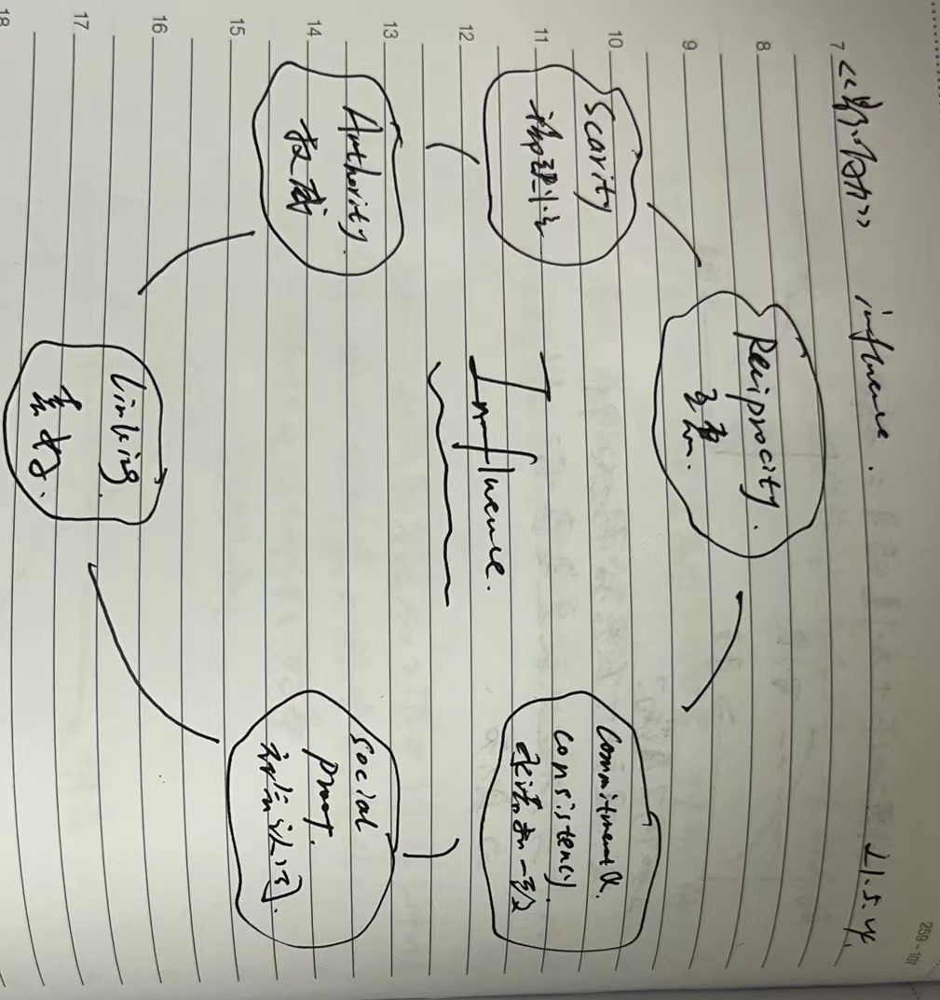

https://item.jd.com/13498550.html
## 时间
2021-05-13
## 地点
无锡清舒道99号博世软件中心
## 笔记
1. 六大原则：
   1. 互惠
   2. 承诺和一致
   3. 社会认同
   4. 喜好
   5. 权威
   6. 稀缺
2. 顺从心理学
   参与或观察：participant observation
3. 影响力武器相同的要素：
   1. 有能力激活一种近乎机械化的过程
   2. 只要掌握了这种能力，就能从中获利
   3. 借助这些武器，即可四两拨千金  
   所以，影响力的关键在于找到那个可以让人被动触发自动执行的“key”。
4. 对比原理：
   认知上的区别。若两样东西一前一后展示出来，且第二样东西和第一样东西有相当大的不同，则我们会认为两者的区别比实际上的更大。
   比如：先看不好的房子，再看好的房子。

5. 6大原则之1: **互惠**
   1. 给予，索取，再索取。
   2. 要是人家给了我们什么好处，我们都会尽力回报。所以，这是人类社会共同的道德基石。
   3. 用法：
      1. 运用于强加的恩惠。
      2. 可触发不平等互换。
      3. 互惠或让步，两条途径。
         1. 迫使接受了对方让步的人以同样的方式回应。
         2. 由于接受了让步的人有回报的义务，人们就乐意率先让步，从而启动有益的交换。  
   所以，率先让步是一种高度有效的顺从技巧。  
   “拒绝-后撤术”：先提大要求，再提小要求（真正目的）。
   4. 破解：
      1. 拒绝请求者最初的善意或让步。（易误伤）
      2. 倘若别人的提议，我们确实赞同，则不妨接受它。倘若这一提议别有所图，则置之不理（preferred）。
6. 6大原则之2: **承诺和一致**
   1. 人人都有一种言行一致（同时也显得言行一致）的愿望。一旦我们做了一个选择，或采取了某种立场，我们立刻就会碰到来自内心和外部的压力，迫使我们按照说的那样去做。在这样的压力下，我们会想方设法地以行动证明自己先前的决定是正确的。  
   所以，最关键的因素：做了选择。
   2. 承诺是关键：
   各行各业的顺从策略专家，诱使我们采取某种行动或做出某种表态，而后通过保持内心一致的压力使我们顺从。
   3. 策略（一种）：以小积大 -> “登门开”。
   4. 破解：
   在接受琐碎请求时，务必小心谨慎。因为一旦同意了，它就有可能影响我们的自我认知。它不仅能提高我们对更大的类似请求的顺从度，还能使我们更乐意去做一些跟先前答应的小要求毫不相干的事情。
   5. 行为，是确定一个人自身信仰，价值观和态度的重要信息源。
   6. 公开承诺具有持久的效力。
   7. 为一个承诺付出的越多，对承诺者的影响越大。
   8. 对于一个想要建立持久凝聚力和卓越感的团体来说，入会活动的艰辛能带来一项宝贵的优势。这种优势，是该团体绝不轻易放弃的。
   9. 只有当我们认为外界不存在强大的压力时，我们才会为自己的行为发自内心的负起责任。
      1.  教育孩子：对于我们希望孩子真心相信的事情，绝不能靠贿赂或威胁让他们去做。这2种行为只会让他们暂时服从。
   10. 另一个破解： 避免**死脑筋**的保持一致。
7.  6大原则之3: **社会认同**【脑子里的怪物】
    1.  原理：
   在判断何为正确时，我们会依据别人的意见和看法。
    2.  “罐头笑声”：
   对社会认同的反应完全是无意识，无条件的。这样一来，偏颇甚至伪造的证据也可愚弄我们。
    3.  多元无知：
   每个人都得出判断：既然没人在乎，那就没什么问题。e.g.：路过的行人越多，越见死不救。与此同时，危险也有可能累积到这样一个程度：某一个体不受看似平静的其他人所影响，采取了行动。
        1. 破解：  
         一般而言，在需要紧急求助的时候，你的最佳策略就是减少不确定性，让周围人注意到你的情况，搞清自己的责任
    4.  适用条件：
        1.  不确定性大的场景
        2.  相似性。在观察与我们相似的人的行为时，社会认同原理能发挥出最大的影响力。
8. 6大原则之4: **喜好**【友好的窃贼】
   1. 我喜欢你的原因：
      1. 外表魅力： 
      “光环效应”： 一个人的某个正面的特征就能主导其他人看待此人的眼光。
      2. 相似性
      3. 恭维
      4. 接触与合作
         1. 设立共同目标
         2. 拼图学习法
      5. 条件反射和关联
         1. 球迷
         2. 广告
9. 6大原则之5: **权威**
【教化下的敬重】
   1. 要素：
      1. 头衔
      2. 身着
      3. 身份标识
   2. 破解：
      1. 权威的资格，以及这些资格是否跟眼前的主题相关
      2. 这个权威是真的吗？
10. 6大原则之6: **稀缺** 【数量少的说了算】
   1. 对失去某种东西的恐惧似乎比获得某一物品的渴望，更能激发人们的行动力。
      1. 瑕疵：错误印刷的纸币。
   2. 逆反心理。稀缺性原理力量来源：
      1. 思维捷径：基本可以根据获得一样东西的难易程度，迅速准确地判断它的质量。
      2. 机会越少的话，自由也会随之丧失。  
   所以，保住既得利益的愿望，是心理逆反理论的核心。因为参与竞争稀缺资源的感觉，有着强大的刺激性。
11. 终章
    1.  矛盾： 自动反应 vs 孤立线索
    2.  关键： 捷径应受到尊重（保护捷径不受虚假信息的干扰）
    3.  主动出击： 采取一切合理的办法——抵制，威胁，对峙，谴责，抗议等等来对抗剥削者。必须奋力一战来捍卫这一宝贵的捷径。